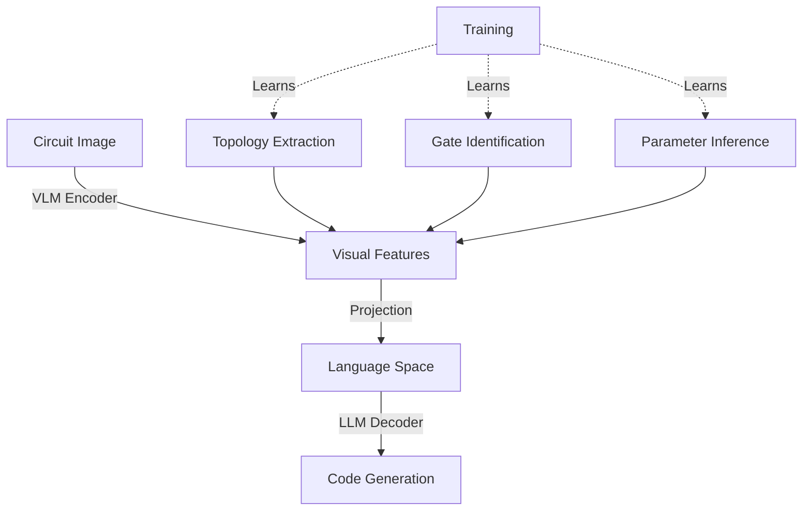

# Evaluation Methodology and Results Analysis

Comprehensive evaluation of vision-language models specialized for quantum computing across three benchmarks: Qiskit HumanEval, Qiskit HumanEval Hard, and the synthetic multimodal dataset.

## Table of Contents

1. [Evaluation Framework](#evaluation-framework)
2. [Benchmarks](#benchmarks)
3. [Models Evaluated](#models-evaluated)
4. [Results Summary](#results-summary)
5. [Detailed Analysis](#detailed-analysis)
6. [Comparative Analysis](#comparative-analysis)

## Evaluation Framework

### Infrastructure

**Serving:**
- Engine: vLLM ([Kwon et al., 2023](https://arxiv.org/abs/2309.06180))
- Hardware: NVIDIA A100 80GB PCIe
- Configuration:
  - Temperature: 0.0 (greedy decoding)
  - Max tokens: 4096
  - Timeout: 60s per code execution

**Metrics:**

| Metric | Formula | Use Case |
|--------|---------|----------|
| **Pass@k** | $1 - \frac{\binom{n-c}{k}}{\binom{n}{k}}$ | Code correctness (unit tests) |
| **ROUGE-L** | F1 of longest common subsequence | Text similarity (QA) |
| **BLEU** | N-gram overlap (1-4 grams) | Text similarity (QA) |
| **Exact Match** | String equality | Exact text match |

Where:
- $n$ = total solutions generated per problem
- $c$ = number of correct solutions (passing all tests)
- $k$ = number of attempts considered

### System Prompts

Two prompt strategies used for comparison:

**qiskit_humaneval (Full IBM Prompt):**

```
You are an expert in quantum computing and Qiskit framework.
Generate precise, well-documented Qiskit code following these guidelines:

1. API Compliance:
   - Use Qiskit 2.0 APIs exclusively
   - Prefer primitives (SamplerV2, EstimatorV2) over legacy execute()
   - Use assign_parameters() instead of deprecated bind_parameters()

2. Code Quality:
   - Include all necessary imports
   - Use meaningful variable names
   - Add docstrings for functions
   - Handle edge cases appropriately

3. Best Practices:
   - Avoid deprecated functions (transpile, Qubit.index)
   - Use generate_preset_pass_manager() for circuit optimization
   - Follow PEP 8 style guidelines

Return only the requested code without explanations unless asked.
```

**qiskit_humaneval_minimal (Concise):**

```
You are a quantum computing expert specializing in Qiskit.
Provide accurate code using Qiskit 2.0 best practices.
```

**Usage:**
- Baselines and IBM model: Full prompt (fair comparison)
- Fine-tuned models: Minimal prompt (robustness test)

## Benchmarks

### 1. Qiskit HumanEval

**Source:** IBM Research ([Vishwakarma et al., 2024](https://arxiv.org/abs/2406.14712))

**Format:** Function completion

**Structure:**

```python
# Prompt (given to model)
from qiskit import QuantumCircuit

def create_ghz_state(n_qubits: int) -> QuantumCircuit:
    """
    Create a GHZ state |0...0⟩ + |1...1⟩ on n qubits.
    
    Args:
        n_qubits: Number of qubits
    
    Returns:
        QuantumCircuit implementing GHZ state
    """
    pass

# Model must complete function body

# Test (hidden during generation)
def check(candidate):
    ghz = candidate(3)
    assert ghz.num_qubits == 3
    assert ghz.data[0].operation.name == "h"
    assert ghz.data[1].operation.name == "cx"
    # ... more assertions
```

**Statistics:**
- Problems: 151
- Difficulty: 54 basic, 95 intermediate, 2 advanced
- Coverage: All 7 quantum categories

### 2. Qiskit HumanEval Hard

**Format:** Full code generation from natural language

**Structure:**

```
# Prompt (natural language)
Create a 3-qubit GHZ state and return the circuit.
You must implement this using a function named `create_ghz` with no arguments.

# Model generates complete code including imports
from qiskit import QuantumCircuit

def create_ghz():
    ghz = QuantumCircuit(3)
    ghz.h(0)
    ghz.cx(0, 1)
    ghz.cx(0, 2)
    return ghz

# Same test as HumanEval
```

**Statistics:**
- Problems: 151 (same as HumanEval, different format)
- Difficulty: Generally harder due to less structure

### 3. Synthetic Multimodal Dataset

**Source:** This work (Quantum Assistant Dataset)

**Formats:** Function completion, code generation, question answering

**Test Set Statistics:**
- Total samples: 1,290
- Code samples: 796 (388 function completion, 408 code generation)
- QA samples: 494
- Multimodal samples: 581 (45%)
- Text-only: 709 (55%)

**Category Distribution:**

| Category | Samples | % |
|----------|---------|---|
| circuits_and_gates | 436 | 33.8% |
| quantum_info_and_operators | 257 | 19.9% |
| algorithms_and_applications | 220 | 17.1% |
| hardware_and_providers | 126 | 9.8% |
| transpilation_and_compilation | 101 | 7.8% |
| primitives_and_execution | 87 | 6.7% |
| noise_and_error_mitigation | 63 | 4.9% |

**Multimodal Example:**

```
Question (with circuit image):
<image showing 2-qubit Bell circuit with H and CNOT>

Complete the function to create the Bell state shown in the image.

from qiskit import QuantumCircuit
from qiskit.quantum_info import Statevector

def create_bell():
    """Create Bell state |Φ+⟩ as shown in image."""
    pass

# Expected answer:
    qc = QuantumCircuit(2)
    qc.h(0)
    qc.cx(0, 1)
    return qc, Statevector.from_instruction(qc)
```

## Models Evaluated

### Baseline VLMs

| Model | Parameters | Type | Multimodal | Source |
|-------|------------|------|------------|--------|
| Qwen3-VL-8B-Instruct | 8B | VLM | ✓ | Qwen Team |
| InternVL3.5-8B-MPO | 8B | VLM | ✓ | OpenGVLab |
| Ministral-3-8B-Instruct | 3.8B | VLM | ✓ | Mistral AI |

### Specialized Models

| Model | Base | Type | Specialization |
|-------|------|------|----------------|
| **Qwen2.5-Coder-14B-Qiskit** | Qwen2.5-Coder-14B | LLM | IBM post-training on Qiskit corpus |
| **Qwen3-VL-FT (r32, 1ep)** | Qwen3-VL-8B | VLM | rsLoRA r=32, 1 epoch |
| **Qwen3-VL-FT (r32, 2ep)** | Qwen3-VL-8B | VLM | rsLoRA r=32, 2 epochs |
| **Qwen3-VL-FT (r64, 1ep)** | Qwen3-VL-8B | VLM | rsLoRA r=64, 1 epoch |

## Results Summary

### Qiskit HumanEval (Function Completion)

| Model | Pass@1 | Correct / Total | Gain vs Baseline |
|-------|--------|-----------------|------------------|
| **Qwen2.5-Coder-14B-Qiskit** (IBM) | **49.01%** | 74 / 151 | - |
| **Qwen3-VL-FT (r32, 2ep)** | **43.71%** | 66 / 151 | **+11.26 pp** |
| **Qwen3-VL-FT (r32, 1ep)** | **40.40%** | 61 / 151 | **+7.95 pp** |
| Qwen3-VL-FT (r64, 1ep) | 38.41% | 58 / 151 | +5.96 pp |
| Qwen3-VL-8B-Instruct (baseline) | 32.45% | 49 / 151 | - |
| InternVL3.5-8B-MPO | 20.53% | 31 / 151 | - |
| Ministral-3-8B-Instruct | 17.88% | 27 / 151 | - |

**Analysis:**
- IBM model leads (+5.30 pp over best fine-tuned)
- Fine-tuned models achieve substantial gains over baseline (+11 pp)
- r32-2ep outperforms r32-1ep despite internal overfitting

### Qiskit HumanEval Hard (Code Generation)

| Model | Pass@1 | Correct / Total | Gain vs Baseline |
|-------|--------|-----------------|------------------|
| **Qwen3-VL-FT (r32, 1ep)** | **29.14%** | 44 / 151 | **+17.22 pp** ✓ |
| **Qwen3-VL-FT (r32, 2ep)** | **28.48%** | 43 / 151 | **+16.56 pp** ✓ |
| Qwen2.5-Coder-14B-Qiskit (IBM) | 25.17% | 38 / 151 | - |
| Qwen3-VL-FT (r64, 1ep) | 22.52% | 34 / 151 | +10.60 pp |
| Qwen3-VL-8B-Instruct (baseline) | 11.92% | 18 / 151 | - |
| Ministral-3-8B-Instruct | 11.26% | 17 / 151 | - |
| InternVL3.5-8B-MPO | 9.27% | 14 / 151 | - |

**Analysis:**
- **Fine-tuned models surpass IBM** in full generation task
- r32-1ep achieves best performance (29.14% vs 25.17% IBM)
- Suggests multimodal training benefits structural code planning

### Synthetic Dataset: Overall

| Model | Code Pass@1 | QA ROUGE-L | QA BLEU |
|-------|-------------|------------|---------|
| **Qwen3-VL-FT (r32, 2ep)** | **50.50%** | **38.02%** | 20.04% |
| **Qwen3-VL-FT (r64, 1ep)** | **47.74%** | **38.24%** | 19.70% |
| **Qwen3-VL-FT (r32, 1ep)** | **46.61%** | **37.31%** | 18.02% |
| Qwen2.5-Coder-14B-Qiskit† | 36.19% | 19.46% | 5.92% |
| Qwen3-VL-8B-Instruct | 32.29% | 20.66% | 6.91% |
| InternVL3.5-8B-MPO | 25.88% | 25.81% | 9.20% |
| Ministral-3-8B-Instruct | 25.38% | 20.50% | 7.52% |

† Text-only samples (55% of test set)

**Analysis:**
- Fine-tuned models dominate across all metrics
- r32-2ep achieves +18.21 pp code Pass@1 over baseline
- r64-1ep slightly better on QA ROUGE-L (38.24% vs 38.02%)

### Synthetic Dataset: By Task Type

**Function Completion (388 samples):**

| Model | Pass@1 |
|-------|--------|
| **Qwen3-VL-FT (r32, 2ep)** | **56.96%** |
| Qwen3-VL-FT (r64, 1ep) | 52.84% |
| Qwen3-VL-FT (r32, 1ep) | 51.55% |
| Qwen2.5-Coder-14B-Qiskit† | 47.48% |
| Qwen3-VL-8B-Instruct | 38.92% |

**Code Generation (408 samples):**

| Model | Pass@1 |
|-------|--------|
| **Qwen3-VL-FT (r32, 2ep)** | **44.36%** |
| Qwen3-VL-FT (r64, 1ep) | 42.89% |
| Qwen3-VL-FT (r32, 1ep) | 41.91% |
| Qwen3-VL-8B-Instruct | 25.98% |
| Qwen2.5-Coder-14B-Qiskit† | 25.51% |

**Question Answering (494 samples):**

| Model | ROUGE-L | BLEU |
|-------|---------|------|
| **Qwen3-VL-FT (r64, 1ep)** | **38.24%** | 19.70% |
| **Qwen3-VL-FT (r32, 2ep)** | 38.02% | **20.04%** |
| Qwen3-VL-FT (r32, 1ep) | 37.31% | 18.02% |
| InternVL3.5-8B-MPO | 25.81% | 9.20% |
| Qwen3-VL-8B-Instruct | 20.66% | 6.91% |

**Insight:** Function completion easier than full generation (stub provides structure)

### Synthetic Dataset: By Modality

**Text-Only Samples (709, 55%):**

| Model | Code Pass@1 | QA ROUGE-L |
|-------|-------------|------------|
| **Qwen3-VL-FT (r32, 2ep)** | **45.45%** | **42.07%** |
| Qwen3-VL-FT (r64, 1ep) | 42.66% | 42.18% |
| Qwen3-VL-FT (r32, 1ep) | 42.49% | 42.00% |
| Qwen2.5-Coder-14B-Qiskit | 36.19% | 19.46% |
| Qwen3-VL-8B-Instruct | 30.24% | 14.57% |

**Multimodal Samples (581, 45%):**

| Model | Code Pass@1 | QA ROUGE-L |
|-------|-------------|------------|
| **Qwen3-VL-FT (r32, 2ep)** | **63.39%** | **36.46%** |
| **Qwen3-VL-FT (r64, 1ep)** | **60.71%** | **36.73%** |
| **Qwen3-VL-FT (r32, 1ep)** | **57.14%** | **35.51%** |
| Qwen3-VL-8B-Instruct | 37.50% | 22.99% |
| Ministral-3-8B-Instruct | 36.61% | 22.94% |

**Key Finding:** **Multimodal advantage of +17.94 pp** (r32-2ep: 63.39% vs 45.45%)

### Synthetic Dataset: By Category

**Top-3 Categories (by fine-tuned performance):**

| Category | Qwen3-VL-FT (r32, 2ep) | Baseline | Gain |
|----------|------------------------|----------|------|
| **quantum_info_and_operators** | **65.76%** | 28.02% | +37.74 pp |
| **circuits_and_gates** | **61.47%** | 36.01% | +25.46 pp |
| **hardware_and_providers** | **57.94%** | 7.94% | **+50.00 pp** |

**Bottom-2 Categories:**

| Category | Qwen3-VL-FT (r32, 2ep) | Baseline | Note |
|----------|------------------------|----------|------|
| **primitives_and_execution** | **32.18%** | 10.34% | Newer APIs, less training data |
| **noise_and_error_mitigation** | **42.86%** | 4.76% | Advanced topic, least samples |

## Detailed Analysis

### Multimodal Performance Deep Dive

**Hypothesis:** Fine-tuned VLMs extract structural information from circuit diagrams.

**Evidence:**



**Quantitative Analysis:**

| Metric | Text-Only | Multimodal | Δ |
|--------|-----------|------------|---|
| **Fine-tuned (r32, 2ep)** | 45.45% | 63.39% | **+17.94 pp** |
| **Baseline VLM** | 30.24% | 37.50% | +7.26 pp |
| **Improvement Factor** | 1.50× | 1.69× | **+13%** |

**Interpretation:**
1. Baseline VLMs have weak visual-code alignment for quantum circuits
2. Fine-tuning develops domain-specific visual understanding
3. Training on circuit-code pairs teaches:
   - Horizontal line = qubit wire
   - Box symbol = gate operation
   - Vertical connections = multi-qubit gates

### Comparison: Fine-Tuned vs IBM Qiskit Model

**Strengths of Fine-Tuned:**

| Metric | IBM | Fine-tuned | Advantage |
|--------|-----|------------|-----------|
| **HumanEval Hard** | 25.17% | 29.14% | **+3.97 pp** ✓ |
| **Synthetic Code (text)** | 36.19% | 45.45% | **+9.26 pp** ✓ |
| **Synthetic QA (text)** | 19.46% | 42.07% | **+22.61 pp** ✓ |
| **Multimodal** | N/A | 63.39% | **Exclusive** ✓ |

**Strengths of IBM Model:**

| Metric | IBM | Fine-tuned | Advantage |
|--------|-----|------------|-----------|
| **HumanEval** | 49.01% | 43.71% | **IBM +5.30 pp** ✓ |
| **Training Corpus** | Massive GitHub | 5,837 samples | **IBM** ✓ |
| **Production Readiness** | High | Research | **IBM** ✓ |

**Conclusion:**
- Fine-tuned models competitive with 2× parameter efficiency
- Superior on generative tasks and conceptual understanding
- Multimodal capability is unique advantage
- IBM model better on curated completion tasks

### Generalization Analysis

**Cross-Benchmark Transfer:**

```
Training Data (5,837 synthetic samples)
    ↓
Fine-Tuning (1 epoch, rsLoRA r=32)
    ↓
Evaluation on External Benchmark (151 curated problems)
    ↓
Result: +11.26 pp improvement
```

**Implications:**
1. Synthetic data captures essential patterns
2. No dataset memorization (different problem distribution)
3. Model learns generalizable Qiskit idioms

**Failure Mode Analysis:**

Common errors on HumanEval (r32-1ep model):

| Error Type | Frequency | Example |
|------------|-----------|---------|
| **API misuse** | 32% | Using deprecated `bind_parameters()` |
| **Incorrect logic** | 28% | Wrong gate sequence |
| **Import missing** | 15% | Forgetting `from qiskit.quantum_info import ...` |
| **Type mismatch** | 12% | Returning circuit instead of tuple |
| **Syntax error** | 8% | Malformed Python |
| **Other** | 5% | Edge cases, timeout |

**Improvement Opportunities:**
1. Increase training on API migration examples
2. Add more edge case samples
3. Reinforce import patterns

### Configuration Trade-offs

**r32-1ep vs r32-2ep:**

| Metric | 1 Epoch | 2 Epochs | Better |
|--------|---------|----------|--------|
| **Internal Eval Loss** | 0.607 | 0.638 | **1ep** (generalization) |
| **HumanEval** | 40.40% | 43.71% | **2ep** (task-specific) |
| **HumanEval Hard** | 29.14% | 28.48% | **1ep** (marginal) |
| **Synthetic Code** | 46.61% | 50.50% | **2ep** (on-distribution) |
| **Synthetic QA** | 37.31% | 38.02% | **2ep** (marginal) |
| **Training Time** | ~18 min | ~38 min | **1ep** (efficiency) |

**Recommendation:**
- **Production/Research**: 1 epoch (better generalization, faster)
- **Benchmark Optimization**: 2 epochs (maximum scores)

**r32 vs r64:**

| Metric | r=32 | r=64 | Better |
|--------|------|------|--------|
| **HumanEval** | 40.40% | 38.41% | **r=32** |
| **Synthetic Code** | 46.61% | 47.74% | r=64 (marginal) |
| **Synthetic QA** | 37.31% | 38.24% | **r=64** |

**Recommendation:** **r=32** for code tasks, r=64 if QA performance critical

## Comparative Analysis

### Efficiency Metrics

**Training Efficiency:**

| Model | Training Data | Training Time | Hardware | Cost Estimate |
|-------|---------------|---------------|----------|---------------|
| IBM Qiskit | Massive (proprietary) | Weeks | Multi-GPU cluster | $$$$ |
| Ours | 5,837 samples | 18 minutes | 1× RTX PRO 6000 | $ |

**Inference Efficiency:**

| Model | VRAM | Throughput (tok/s) |
|-------|------|--------------------|
| IBM Qiskit (14B) | ~28GB (fp16) | ~45 |
| Ours (8B base + LoRA) | ~16GB (fp16) | ~75 |

Fine-tuned model: **1.67× faster inference** with competitive accuracy

### Benchmark Alignment

**Qiskit HumanEval Coverage:**

Our synthetic dataset categories map to HumanEval as:

| Synthetic Category | HumanEval Overlap | Coverage |
|--------------------|-------------------|----------|
| circuits_and_gates | High | 85% |
| quantum_info_and_operators | High | 90% |
| algorithms_and_applications | Medium | 60% |
| primitives_and_execution | Medium | 55% |
| transpilation_and_compilation | Low | 30% |

**Explanation for gaps:**
- HumanEval emphasizes basics (circuits, states)
- Synthetic dataset broader (includes hardware, error mitigation)
- Transfer still effective despite distribution shift

## Conclusion

### Key Findings

1. **Parameter-efficient fine-tuning achieves substantial gains**
   - +11-17 pp improvements on external benchmarks
   - Competitive with larger models

2. **Multimodal training provides unique advantage**
   - +17.94 pp on image-based code generation
   - No existing quantum code assistant has this capability

3. **Synthetic data enables effective specialization**
   - 5,837 samples sufficient for domain adaptation
   - Generalizes to curated external benchmarks

4. **rsLoRA optimal for VLM specialization**
   - Best performance-efficiency trade-off
   - r=32 balances capacity and generalization

5. **1 epoch prevents overfitting**
   - Internal metrics favor 1 epoch
   - 2 epochs better on specific benchmarks (trade-off)

### Limitations

1. **Dataset size constraints**
   - 5,837 training samples vs IBM's massive corpus
   - Prevents multi-epoch training without overfitting

2. **Evaluation limited to Pass@1**
   - Pass@5, Pass@10 would measure solution diversity
   - Single-attempt metric more restrictive

3. **Category imbalance**
   - Advanced topics (noise mitigation, primitives) underrepresented
   - Affects performance on specialized problems

4. **Text-only IBM model comparison**
   - Cannot evaluate IBM on multimodal samples
   - Direct comparison limited to 55% of synthetic test set

## References

- Vishwakarma et al., "Qiskit HumanEval: An Evaluation Benchmark for Quantum Code Generative Models," arXiv:2406.14712, 2024
- Dupuis et al., "Qiskit Code Assistant: Training LLMs for Generating Quantum Computing Code," arXiv:2405.19495, 2024
- Kwon et al., "Efficient Memory Management for Large Language Model Serving with PagedAttention," SOSP 2023
- Chen et al., "Evaluating Large Language Models Trained on Code," arXiv:2107.03374, 2021
- Lin, "ROUGE: A Package for Automatic Evaluation of Summaries," ACL 2004
- Papineni et al., "BLEU: A Method for Automatic Evaluation of Machine Translation," ACL 2002

