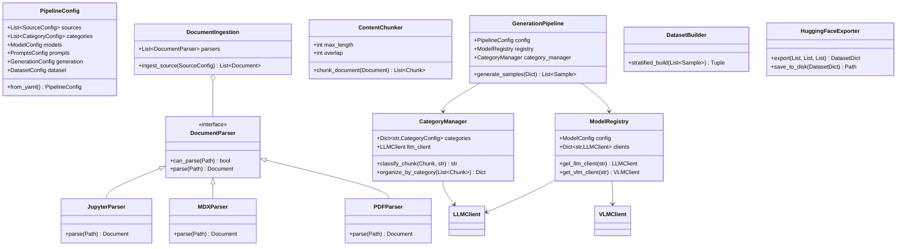
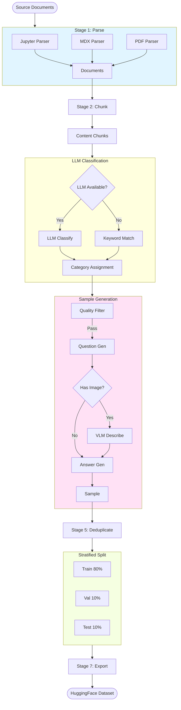
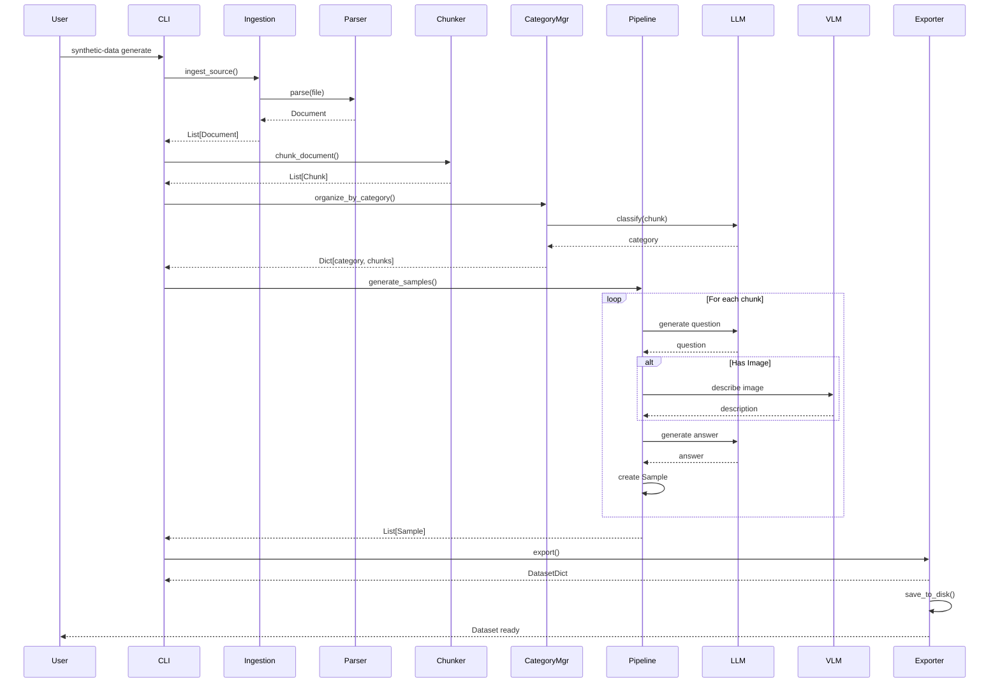

# Synthetic Data Generation - Technical Documentation

## Architecture

### Image Resolution

The system includes an `ImageResolver` that handles different image source types:

- **PDF images**: `pdf:file.pdf:page0:img0` → Extracts actual bytes using PyMuPDF and saves to `outputs/images/`
- **Notebook attachments**: `attachment:image.png` → Extracts base64 data and saves to `outputs/images/`
- **Documentation paths**: `/learning/images/...` → Resolves to `data/.../public/learning/images/...` (both MDX and Jupyter)
- **Direct/relative paths**: Already on disk → Returns absolute path

All resolved image paths are stored in `ImageReference.resolved_path` for use during generation.

### Class Diagram



### Pipeline Flow



### Data Flow



## Configuration Schema

### Complete Structure

```yaml
sources:                    # Input sources
  - path: string           # Local path or GitHub URL
    type: directory|github
    folders: [...]          # For GitHub repos
    include_patterns: [...] # File patterns to include
    exclude_patterns: [...] # File patterns to exclude

categories:                 # Knowledge domains
  - name: string
    description: string     # Used for LLM classification
    weight: float          # Relative sample allocation

models:
  endpoints:
    - name: string
      base_url: string
      api_key: string      # Supports ${ENV_VAR}
      model_name: string
      max_tokens: int
      temperature: float

prompts:                    # All prompts customizable
  question_generation: string
  answer_generation: string
  summary_generation: string
  caption_generation: string
  code_generation: string
  content_quality_check: string
  image_quality_check: string
  category_classification: string

generation:
  target_samples: int
  question_model: string
  vision_model: string
  answer_model: string
  
  batch_size: int
  multimodal_ratio: float
  
  question_types: [qa, code, caption, summary]
  question_type_weights: {qa: 1.0, ...}
  
  difficulty_levels: [easy, medium, hard]
  difficulty_weights: {easy: 1.0, ...}
  
  max_context_length: int
  chunk_overlap: int
  
  enable_content_filtering: bool
  enable_deduplication: bool
  similarity_threshold: float

dataset:
  name: string
  description: string
  parsed_dir: Path
  generated_dir: Path
  final_dir: Path
  images_dir: Path
  train_split: float
  val_split: float
  test_split: float
  license: string

seed: int
```

## Sample Structure

```json
{
  "question": "What is quantum superposition?",
  "answer": "Quantum superposition is...",
  "category": "quantum_fundamentals",
  "question_type": "qa",
  "difficulty": "easy",
  "image": null,
  "has_image": false,
  "code_context": "",
  "source_path": "data/intro.ipynb",
  "metadata": {}
}
```

## Extension Points

### Add New Parser

```python
from synthetic_data.parsers.base import DocumentParser, Document

class CustomParser(DocumentParser):
    def can_parse(self, path: Path) -> bool:
        return path.suffix == ".custom"
    
    def parse(self, path: Path) -> Document:
        # Implementation
        pass

# Register in ingestion.py
```

### Add New Question Type

```python
# 1. Update enum in config/schema.py
class QuestionType(str, Enum):
    MY_TYPE = "my_type"

# 2. Add prompt in config.yaml
prompts:
  my_type_generation: |
    Your prompt template
    {context}

# 3. Update PromptSet in generators/prompts.py
```

## Caching System

The pipeline includes an intelligent caching system for incremental processing:

### Features
- **Per-source caching** - each data source cached independently
- **Incremental saving** - cache saved after each source completes
- **Interrupt-safe** - Ctrl+C preserves already-processed sources
- **Automatic cache invalidation** when files or config change
- **Manual cache control** via CLI commands

### Cache Commands

```bash
# Show cache information
synthetic-data cache-info --config config.yaml

# Clear all cache
synthetic-data cache-clear --config config.yaml

# Clear specific stage cache
synthetic-data cache-clear --config config.yaml --stage parse

# Run without using cache
synthetic-data parse --config config.yaml --no-cache

# Clear cache before running
synthetic-data parse --config config.yaml --clear-cache
```

### Cache Location
Cache is stored in `outputs/.cache/` with manifest tracking:
- **Per-source cache files** - Each data source gets its own cache file
- **File modification times** - Automatic invalidation on file changes
- **Configuration parameters** - Invalidation on config changes
- **Processing timestamps** - Track when each source was processed

### How It Works
1. Each source path gets a unique cache identifier (MD5 hash)
2. Cache saved immediately after each source completes
3. On Ctrl+C, already-processed sources remain cached
4. Next run loads cached sources, only processes uncached ones
5. File changes automatically invalidate affected source caches

## Progress Tracking

All pipeline stages now show detailed progress:
- **Accurate progress bars** tracking files processed (not documents)
- **File and document counts** - Shows "X docs from Y files"
- **Running totals** - "[42/1135] Processed..." shows cumulative progress
- **Time elapsed** and **time remaining** estimates
- **Separate tracking** for cached vs newly-processed sources

## Testing

Run integration tests:

```bash
python tests/test_integration.py
```

Tests:
- Endpoint connectivity
- Document parsing (all formats)
- Content chunking
- Full ingestion pipeline
- Configuration validation
- Cache functionality

